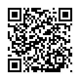
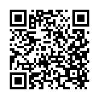

<!-- _paginate: false -->

# Sheet Music Playback Web

### View scores. Press play. Watch the notes light up. 🎵

ADC Japan 2026 Hackathon

---

## What it does

- **Load a score** — drop your own file (`.mxl` / `.musicxml` / `.xml` / `.mei`) or pick a sample
- **Rendered as real engraved sheet music** in the browser
- **Press play → notes light up in sync** with the MIDI
- **Piano-roll view** alongside the score
- **Click a note to seek** to that moment

---

## How it works

One shared **Verovio** toolkit (WebAssembly) → notation, MIDI, and seeking all share the **same note IDs**, which keeps highlighting and clicks aligned with the audio.

- **Verovio** — MusicXML/MEI → SVG notation **+** MIDI
- **html-midi-player** — MIDI playback & piano roll

`React 19` · `TypeScript` · `Vite` · `Verovio` · `html-midi-player`

---

## Try it out

| Demo | GitHub |
| :---: | :---: |
|  |  |
| **Live Demo** | **Source Code** |
